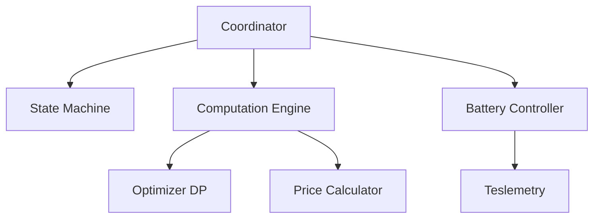

## What I Do

Keep LocalShift documentation in sync with code changes. I auto-update ENTITY_REFERENCE.md when entities change, generate architecture diagrams, create changelogs, and ensure docs match implementation.

## When to Use Me

- "Update documentation for these changes"
- "Sync ENTITY_REFERENCE.md"
- "Generate changelog"
- "Update architecture docs"
- "Docs are out of date"
- "Add docstrings"
- "Generate API docs"
- "Update entity count"

## Documentation Files

Current documentation structure:

```
docs/
├── ARCHITECTURE.md          # System architecture
├── ENTITY_REFERENCE.md      # All 53 entities (1316 lines!)
├── DEVELOPER_GUIDE.md       # Developer guide
├── DEAD_CODE_REPORT.md      # Dead code analysis
├── FORECAST_DRIVEN_CONTROL.md
├── LEARNING_SYSTEM.md
├── LOAD_FORECASTING.md
├── LOAD_SHIFTING_GUIDE.md
├── NOTIFICATIONS.md
├── TROUBLESHOOTING.md
└── CHANGELOG.md            # (Generated)
```

## Auto-Sync Capabilities

### 1. ENTITY_REFERENCE.md Sync

When entities change, update:

- Entity counts (53 total: 27 sensors, 10 binary sensors, etc.)
- Entity IDs and descriptions
- Attributes and their types
- State classes and units
- Platform-specific information

**Template structure:**
```markdown
## Sensors (27)

### sensor.localshift_battery_percent
- **Description:** Current battery percentage
- **Type:** Sensor
- **State Class:** measurement
- **Unit:** %
- **Attributes:**
  - `capacity_kwh`: float
  - `max_charge_kw`: float
  - `max_discharge_kw`: float
```

### 2. Architecture Diagram Updates

Keep ARCHITECTURE.md in sync with code:

```markdown
## Component Overview


```

### 3. Changelog Generation

Generate from commit history:

```bash
# Generate changelog since last tag
git log --pretty=format:"- %s (%h)" v1.0.0..HEAD > docs/CHANGELOG.md

# Categorize commits
- Features: feat:
- Fixes: fix:
- Docs: docs:
- Refactor: refactor:
- Tests: test:
```

## Sync Workflows

### Workflow 1: Post-Entity-Change Sync

```bash
#!/bin/bash
# sync-docs.sh

# 1. Count entities by platform
SENSORS=$(grep -c "class.*Sensor" custom_components/localshift/sensor.py)
BINARY=$(grep -c "class.*BinarySensor" custom_components/localshift/binary_sensor.py)
SWITCHES=$(grep -c "class.*Switch" custom_components/localshift/switch.py)
NUMBERS=$(grep -c "class.*Number" custom_components/localshift/number.py)
SELECTS=$(grep -c "class.*Select" custom_components/localshift/select.py)
BUTTONS=$(grep -c "class.*Button" custom_components/localshift/button.py)

TOTAL=$((SENSORS + BINARY + SWITCHES + NUMBERS + SELECTS + BUTTONS))

echo "Total entities: $TOTAL"
echo "  Sensors: $SENSORS"
echo "  Binary Sensors: $BINARY"
echo "  Switches: $SWITCHES"
echo "  Numbers: $NUMBERS"
echo "  Selects: $SELECTS"
echo "  Buttons: $BUTTONS"

# 2. Update ENTITY_REFERENCE.md header
sed -i "s/Total: [0-9]*/Total: $TOTAL/" docs/ENTITY_REFERENCE.md
```

### Workflow 2: Docstring Coverage Check

```bash
# Check docstring coverage
uv run interrogate custom_components/localshift -v

# Generate missing docstrings report
uv run interrogate custom_components/localshift --generate-badge docs/assets/docstring-coverage.svg
```

### Workflow 3: Architecture Drift Detection

Compare code structure against ARCHITECTURE.md:

```python
# Check if documented modules exist
expected_modules = [
    "coordinator.py",
    "state_machine.py",
    "computation_engine.py",
    "battery_controller.py",
    # ... from ARCHITECTURE.md
]

for module in expected_modules:
    if not os.path.exists(f"custom_components/localshift/{module}"):
        print(f"⚠️  Documented module missing: {module}")

# Check for undocumented modules
actual_modules = glob("custom_components/localshift/*.py")
documented = set(expected_modules)
actual = set(os.path.basename(m) for m in actual_modules)

for module in actual - documented:
    print(f"❓ Undocumented module: {module}")
```

## Entity Reference Generator

```python
#!/usr/bin/env python3
"""Generate ENTITY_REFERENCE.md from source code."""

import ast
import re
from pathlib import Path

class EntityExtractor(ast.NodeVisitor):
    def __init__(self):
        self.entities = []
    
    def visit_ClassDef(self, node):
        # Check if it's an entity class
        for base in node.bases:
            if isinstance(base, ast.Name):
                if 'Entity' in base.id or 'Sensor' in base.id:
                    self._extract_entity(node)
    
    def _extract_entity(self, node):
        entity = {
            'name': node.name,
            'docstring': ast.get_docstring(node),
            'properties': []
        }
        
        for item in node.body:
            if isinstance(item, ast.FunctionDef) and item.name.startswith('_attr_'):
                entity['properties'].append(item.name[6:])
        
        self.entities.append(entity)

def generate_entity_reference():
    """Generate ENTITY_REFERENCE.md content."""
    
    output = ["# LocalShift Entity Reference\n"]
    output.append("Auto-generated from source code.\n")
    output.append("Last updated: {date}\n\n".format(date=datetime.now()))
    
    # Process each platform
    platforms = {
        'sensor': 'Sensors',
        'binary_sensor': 'Binary Sensors',
        'switch': 'Switches',
        'number': 'Numbers',
        'select': 'Selects',
        'button': 'Buttons'
    }
    
    total = 0
    for platform, title in platforms.items():
        file_path = Path(f"custom_components/localshift/{platform}.py")
        if not file_path.exists():
            continue
        
        with open(file_path) as f:
            tree = ast.parse(f.read())
        
        extractor = EntityExtractor()
        extractor.visit(tree)
        
        count = len(extractor.entities)
        total += count
        
        output.append(f"## {title} ({count})\n\n")
        
        for entity in extractor.entities:
            output.append(f"### {entity['name']}\n")
            if entity['docstring']:
                output.append(f"{entity['docstring']}\n")
            output.append("\n")
    
    output.insert(2, f"**Total Entities: {total}**\n\n")
    
    return ''.join(output)

if __name__ == "__main__":
    content = generate_entity_reference()
    Path("docs/ENTITY_REFERENCE.md").write_text(content)
    print(f"Generated ENTITY_REFERENCE.md with entity documentation")
```

## Changelog Generator

```python
#!/usr/bin/env python3
"""Generate CHANGELOG.md from git history."""

import subprocess
import re
from datetime import datetime
from collections import defaultdict

def get_commits_since(tag=None):
    """Get commits since last tag or all commits."""
    
    if tag:
        cmd = f"git log {tag}..HEAD --pretty=format:'%h|%s|%ad' --date=short"
    else:
        cmd = "git log --pretty=format:'%h|%s|%ad' --date=short"
    
    result = subprocess.run(cmd, shell=True, capture_output=True, text=True)
    
    commits = []
    for line in result.stdout.strip().split('\n'):
        if '|' in line:
            hash_, message, date = line.split('|', 2)
            commits.append({
                'hash': hash_,
                'message': message,
                'date': date
            })
    
    return commits

def categorize_commit(message):
    """Categorize commit by conventional commits."""
    
    patterns = {
        'Features': r'^feat[(:]',
        'Bug Fixes': r'^fix[(:]',
        'Documentation': r'^docs[(:]',
        'Refactoring': r'^refactor[(:]',
        'Tests': r'^test[(:]',
        'Chores': r'^chore[(:]',
        'Other': r'.*'
    }
    
    for category, pattern in patterns.items():
        if re.match(pattern, message, re.IGNORECASE):
            return category
    
    return 'Other'

def generate_changelog():
    """Generate formatted changelog."""
    
    commits = get_commits_since()
    
    # Group by category
    categories = defaultdict(list)
    for commit in commits:
        category = categorize_commit(commit['message'])
        categories[category].append(commit)
    
    # Generate markdown
    output = ["# Changelog\n"]
    output.append(f"Generated: {datetime.now().strftime('%Y-%m-%d')}\n\n")
    
    for category in ['Features', 'Bug Fixes', 'Documentation', 'Refactoring', 'Tests', 'Chores', 'Other']:
        if category in categories:
            output.append(f"## {category}\n\n")
            for commit in categories[category]:
                clean_msg = re.sub(r'^(feat|fix|docs|refactor|test|chore)[(:]\s*', '', commit['message'])
                output.append(f"- {clean_msg} ({commit['hash']})\n")
            output.append("\n")
    
    return ''.join(output)

if __name__ == "__main__":
    changelog = generate_changelog()
    Path("docs/CHANGELOG.md").write_text(changelog)
    print("Generated CHANGELOG.md")
```

## Validation Checks

### Check Documentation Completeness

```bash
#!/bin/bash
# validate-docs.sh

echo "📚 Validating documentation..."

# Check ENTITY_REFERENCE.md is up to date
CURRENT_COUNT=$(grep -c "^## " docs/ENTITY_REFERENCE.md)
ACTUAL_COUNT=$(find custom_components/localshift -name "*.py" -exec grep -c "class.*Entity" {} + | awk '{sum+=$1} END {print sum}')

if [ "$CURRENT_COUNT" -ne "$ACTUAL_COUNT" ]; then
    echo "❌ ENTITY_REFERENCE.md out of date"
    echo "   Documented: $CURRENT_COUNT sections"
    echo "   Actual entities: $ACTUAL_COUNT"
    exit 1
fi

# Check for TODO in docs
if grep -r "TODO\|FIXME\|XXX" docs/; then
    echo "⚠️  Found TODOs in documentation"
fi

# Check all entities are documented
for entity_file in custom_components/localshift/sensor.py custom_components/localshift/binary_sensor.py; do
    if [ -f "$entity_file" ]; then
        # Extract entity classes
        entities=$(grep -o "class \w*Entity" "$entity_file" | sed 's/class //' | sed 's/Entity//')
        for entity in $entities; do
            if ! grep -q "$entity" docs/ENTITY_REFERENCE.md; then
                echo "❌ Undocumented entity: $entity in $entity_file"
            fi
        done
    fi
done

echo "✅ Documentation validation complete"
```

## Integration with CI

Add to `.github/workflows/docs.yml`:

```yaml
name: Documentation

on:
  push:
    paths:
      - 'custom_components/localshift/**'
      - 'docs/**'

jobs:
  validate:
    runs-on: ubuntu-latest
    steps:
      - uses: actions/checkout@v3
      
      - name: Check entity counts
        run: |
          ./scripts/validate-entity-counts.sh
      
      - name: Generate changelog
        run: |
          python scripts/generate-changelog.py
          git diff --exit-code docs/CHANGELOG.md || echo "::warning::Changelog needs update"
      
      - name: Check docstrings
        run: |
          uv run interrogate custom_components/localshift --fail-under=80
```

## Tips

1. **Run after entity changes** - Keep ENTITY_REFERENCE.md in sync
2. **Generate on release** - Create changelog when tagging
3. **Check coverage** - Docstrings improve with interrogate
4. **Version the docs** - Track when docs were last updated
5. **Automate in CI** - Catch documentation drift early
6. **Use templates** - Consistent formatting
7. **Include examples** - Show usage in docs
8. **Cross-reference** - Link between related docs

## Quick Commands

```bash
# Sync entity reference
python scripts/generate-entity-reference.py

# Generate changelog
python scripts/generate-changelog.py

# Check docstring coverage
uv run interrogate custom_components/localshift -v

# Validate docs
./scripts/validate-docs.sh

# Update all docs
./scripts/sync-all-docs.sh
```
