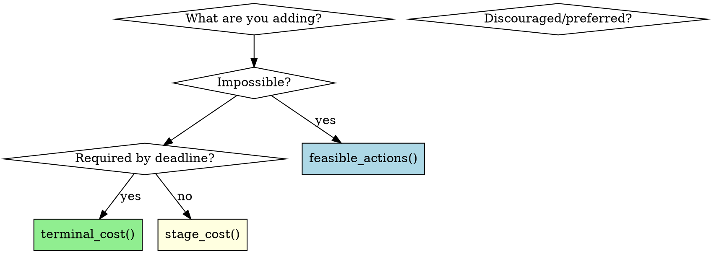

# DP Optimizer Modification

## Overview

The LocalShift DP optimizer uses a three-layer system. Where you add code determines its behavior:

| Question | Answer | Layer |
|----------|--------|-------|
| Impossible/forbidden? | Add to `feasible_actions()` | Hard constraints |
| Required by deadline? | Add to `terminal_cost()` | Terminal cost |
| Discouraged/preferred? | Add penalty to `stage_cost()` | Soft penalties |

## The Three Layers

### Layer 1: Hard Constraints (`feasible_actions()`)

**What it does:** Determines which actions are physically/legal possible.

**Add here when:**
- Physical impossibility: Battery cannot charge when full
- Safety requirements: Never drop below minimum SOC
- Regulatory/contractual: Demand window has no grid import
- Feature gates: Disable certain actions based on configuration

**Current constraints:**
| Constraint | Effect |
|------------|--------|
| SOC floor/ceiling | Can't charge if full, can't discharge if empty |
| Demand window | No grid import during DW slots |
| Price thresholds | Only charge if price is cheap |
| Solar sufficiency | Suppress grid charging when solar covers deficit |
| Export profitability | Only export if sell price exceeds threshold |
| Negative-FIT DW guardrail | DW export only if net benefit >= $0.02/kWh |

**Example:**
```python
@staticmethod
def feasible_actions(...) -> list[PlannerAction]:
    actions = []
    
    # ... existing constraints ...
    
    # Quiet hours constraint (new)
    slot_hour = datetime.fromisoformat(slot.timestamp_iso).hour
    is_quiet_hours = slot_hour >= 22 or slot_hour < 6
    
    if can_discharge and not is_quiet_hours:
        if config.optimization_mode == "self_consumption":
            if slot.sell_price >= min_profitable_sell:
                actions.append(PlannerAction.EXPORT_PROACTIVE)
    
    return actions
```

### Layer 2: Soft Penalties (`stage_cost()`)

**What it does:** Encodes preferences and costs into a scalar cost.

**Add here when:**
- Economic trade-offs: Cost vs. benefit analysis
- Behavioral bias: Encourage/discourage certain patterns
- Risk management: Account for uncertainty
- Multi-objective optimization: Balance competing goals

**Current penalties:**
| Penalty | Formula | Purpose |
|---------|---------|---------|
| `import_cost` | `grid_import × buy_price` | Direct cost |
| `export_revenue` | `grid_export × sell_price` | Revenue |
| `switching_penalty` | `$0.02` if action ≠ current | Stability |
| `uncertainty_penalty` | Scales with horizon gap | Risk aversion |
| `self_consumption_value` | `battery_for_load × $0.15/kWh` | Opportunity cost |
| `solar_opportunity_penalty` | `full_economic_benefit × factor` (factor in [0,1]) | Discourages grid charging when solar is forecast (#610) |

**Net cost formula:**
```python
net_cost = (
    import_cost 
    - export_revenue 
    + switching_penalty 
    + uncertainty_penalty 
    - self_consumption_value
    + solar_opportunity_penalty
)
```

**Example:**
```python
@staticmethod
def stage_cost(...) -> ObjectiveTerms:
    # ... existing terms ...
    
    # Peak demand penalty (new)
    peak_demand_penalty = 0.0
    if action in (PlannerAction.CHARGE_GRID_NORMAL, PlannerAction.CHARGE_GRID_BOOST):
        slot_hour = datetime.fromisoformat(slot.timestamp_iso).hour
        is_peak_hour = slot_hour in range(17, 21)  # 5 PM - 9 PM
        if is_peak_hour:
            peak_demand_penalty = grid_import_kwh * 0.02
    
    return ObjectiveTerms(
        # ... existing fields ...
        peak_demand_penalty=peak_demand_penalty,
        net_cost=net_cost + peak_demand_penalty,
    )
```

### Layer 3: Terminal Cost (`terminal_cost()`)

**What it does:** Creates forward-looking incentive for goal states.

**Add here when:**
- Requirements: What MUST be achieved by a specific point
- Deadlines: Goal state that must be reached by a time

**Current terminal costs:**
| Requirement | Formula | Applied At |
|------------|---------|------------|
| Demand window target | `max(0, target - SOC) × $0.03/%` | DW entry slot |

**Why it works:** Creates backwards incentive through DP:
```
At DW entry (slot T):
  penalty = shortfall × rate

At slot T-1:
  DP considers: "If I don't charge now, I'll pay penalty at T"
  Result: Charge if penalty > cost of charging
```

## Decision Flowchart



## Code Locations

| Layer | File | Line |
|-------|------|------|
| Hard Constraints | `optimizer_dp.py` | ~1341 |
| Soft Penalties | `optimizer_dp.py` | ~1721 |
| Terminal Cost | `optimizer_dp.py` | ~1818 |

## Common Mistakes

### Mistake 1: Adding soft constraint as hard constraint

```python
# BAD: Adding preference as hard constraint
def feasible_actions(...):
    if price > expensive_threshold:
        return []  # Never charge at expensive prices
```

**Fix:** Use stage_cost() penalty instead:
```python
# GOOD: Discourage but don't forbid
expensive_price_penalty = grid_import_kwh * (price - cheap_threshold) * 0.5
```

### Mistake 2: Forgetting to update ObjectiveTerms

```python
# BAD: Adding penalty without updating return type
def stage_cost(...) -> ObjectiveTerms:
    new_penalty = calculate_penalty()
    return ObjectiveTerms(
        # ... forgot to include new_penalty ...
    )
```

**Fix:** Add field to ObjectiveTerms dataclass first.

### Mistake 3: Using stage_cost for hard safety limits

```python
# BAD: Safety limit as penalty (might be violated)
def stage_cost(...):
    if soc < min_soc:
        penalty = 1000  # Huge penalty - but might still be chosen!
```

**Fix:** Use feasible_actions() for hard limits:
```python
# GOOD: Hard constraint - physically impossible
def feasible_actions(...):
    if soc <= min_soc:
        # Remove discharge options
        actions = [a for a in actions if a != PlannerAction.DISCHARGE]
```

## Testing

After modifying any layer:
1. Run `uv run pytest` - all tests must pass
2. Check coverage: `uv run pytest --cov=custom_components/localshift --cov-report=term-missing`
3. Verify shadow mode still works (if applicable)

## See Also

- `docs/PLANNING_MODEL.md` - Full planning model documentation
- `custom_components/localshift/engine/AGENTS.md` - Engine rules
